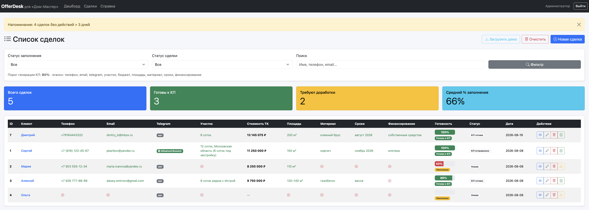

# OfferDesk

Веб-сервис (CRM) для менеджера отдела продаж компании «Дом-Мастер»: от транскрибации телефонного звонка до утверждённого коммерческого предложения клиенту.



Это **не чат-бот**. OfferDesk — полноценное рабочее место в браузере: сделки, эталон протокола, генерация PDF-КП, утверждение и отправка. Telegram используется только как **канал доставки** готового КП клиенту (если клиент привязал чат по ссылке из карточки). Основной канал — **email**.

После звонка менеджер создаёт сделку, вставляет протокол (текст или файл), видит процент заполнения эталона и либо генерирует КП, либо дособирает данные по готовому скрипту вопросов.

> **About (для GitHub):** OfferDesk — веб-CRM отдела продаж «Дом-Мастер», не чат-бот. Транскрибация звонка → эталон → КП (PDF) → отправка клиенту. Email — основной канал. Flask · Docker · OpenAPI.

Прод: [http://194.67.103.144:5001](http://194.67.103.144:5001) · health: `GET /health`

📚 **Документация:** [`docs/DOCUMENTATION.md`](docs/DOCUMENTATION.md)  
👥 **Для менеджеров ОП:** [`docs/РУКОВОДСТВО_МЕНЕДЖЕРА.md`](docs/РУКОВОДСТВО_МЕНЕДЖЕРА.md)  
🛠️ **Ops / VPS:** [`docs/OPS_CRM.md`](docs/OPS_CRM.md)  
📡 **OpenAPI 3.1:** [`docs/openapi.yaml`](docs/openapi.yaml)  
🐳 **Docker:** [`docs/DOCKER.md`](docs/DOCKER.md) · **Docker Hub → сервер:** [`docs/DOCKER_HUB.md`](docs/DOCKER_HUB.md)  
📄 **Отчёт для куратора:** [`docs/ОТЧЁТ_ДЛЯ_КУРАТОРА_AI_автоматизация.md`](docs/ОТЧЁТ_ДЛЯ_КУРАТОРА_AI_автоматизация.md)  
📊 **Бизнес-презентация:** [`docs/2026-08-21_offerdesk_biz-presentation.pdf`](docs/2026-08-21_offerdesk_biz-presentation.pdf)  
🔍 **Аудит кода:** [`AUDIT.md`](AUDIT.md)

---

## Зачем это нужно

После звонка менеджер обычно вручную собирает смету и КП. OfferDesk берёт **текст транскрибации**, сверяет с эталоном, ведёт сделку и собирает **готовое КП** (OpenAI + Jinja2 + WeasyPrint).

Цена тёплого контура «Дом-Мастер»: **площадь × 75 000 ₽/м²**. Цифры в документах ориентировочные; финал — после выезда и спецификации. Для домов из клееного бруса («Дом Форест») считается отдельная смета по этапам, без ставки м².

---

## Возможности

### Рабочее место менеджера (веб-CRM)

- вход по логину/паролю, сессии Flask, справка внутри интерфейса;
- роли: менеджер и **администратор** (`admin` + `CRM_ADMIN_USERS`) — удаление сделок, очистка списка и загрузка демо только у админа;
- **дашборд:** воронка звонок → КП → отправка → закрытие, средний чек, сделки в работе, график за 14 дней, разбивка по статусам;
- **список сделок:** поиск по клиенту/контактам, фильтры по статусу и % заполнения, пагинация, бейджи готовности;
- адаптивный интерфейс: на телефоне список карточками, в карточке сделки — закреплённые кнопки внизу экрана.

### Сделка из транскрибации

- новая сделка: имя клиента + текст протокола **или файл** `.txt` / `.docx` / `.pdf`;
- локальный парсер вытягивает телефон, email, участок, площадь, материал, сроки, финансирование, бюджет, Telegram;
- правка полей вручную (оверрайды) с пересчётом % эталона;
- учебные протоколы в `knowledge_base/` (полный комплект, пропуски, без финансирования, пустой звонок) и кнопка «Загрузить демо» у администратора.

### Проверка по эталону

Сравнение с `knowledge_base/etalon_protocol.md` (regex-парсер + % заполнения):

| % заполнения | Что видит менеджер |
|---|---|
| **≥ 80%** | Можно генерировать КП |
| 50–79% | Страница «Недостающие данные» + готовые вопросы клиенту |
| &lt; 50% | Много пропусков — перезвонить по скрипту |

Обязательные поля: телефон, email, участок, площадь, материал, сроки, финансирование. Бюджет и Telegram клиента — опциональны. Для **клееного бруса** дополнительно обязателен **проект каталога** («Дом Форест»). Порог генерации задаётся `ETALON_KP_THRESHOLD` (по умолчанию 80).

### Коммерческое предложение

Два шаблона PDF (система выбирает по материалу стен):

| Шаблон | Когда | Как считается |
|---|---|---|
| **Тёплый контур «Дом-Мастер»** | газобетон / стандарт компании | площадь × 75 000 ₽/м² |
| **Клееный брус «Дом Форест»** | в протоколе брус / клееный брус | смета по этапам + 5% накладных; логотип и соцсети в шаблоне |

Пайплайн КП:

- генерация PDF-черновика (водяной знак «ЧЕРНОВИК»);
- **утверждение** менеджером (водяной знак «УТВЕРЖДЕНО») — черновик клиенту не уходит;
- повтор генерации без LLM при обрыве сети / таймауте OpenAI;
- коммерческие условия — связный текст (отклоняем JSON/словарь от модели);
- кириллица в PDF: DejaVu Sans.

### Отправка клиенту и статусы

- **Email (SMTP)** — основной канал;
- **Telegram** — опция: персональная ссылка из карточки → клиент жмёт «Старт» → КП уходит в чат;
- outbox, если Telegram API недоступен с VPS;
- статусы: новая → неполные данные → КП готово → отправлено → завершена / проиграна;
- вкладки карточки: **Основное / КП / История / Файлы**;
- журнал действий (`action_log`);
- напоминания по сделкам без движения больше 3 дней (cooldown повторных алертов).

### Документы сверх CRM (CLI / HTTP API)

Помимо рабочего места менеджера доступны:

- архитектурный бриф (**АР**) и инженерный раздел (**ИР**);
- варианты КП и сводный PDF / ZIP;
- клиентский и дизайн-отчёты из транскрибации.

Точки входа: `main.py` (CLI), Flask API (`flask_app.py`), тот же контракт на **Go** (`go_server/`). Контракт: [`docs/openapi.yaml`](docs/openapi.yaml) — `/health`, `/api/report`, `/api/kp`.

### Инфраструктура и качество

- Docker и Docker Compose; образы на Docker Hub;
- production на VPS: Waitress + systemd, logrotate, health-check каждые 5 минут с алертом;
- OpenAI через NL-прокси (`OPENAI_PROXY`) для VPS в РФ;
- бэкап `deals.db` при деплое и перед загрузкой демо;
- токен HTTP API (`FLASK_API_TOKEN`); allowlist Telegram (`TELEGRAM_ALLOWED_IDS`);
- unit- и e2e-тесты: эталон, пайплайн CRM, аналитика, напоминания, КП газобетон / брус, smoke CRM.

---

## Стек

| Слой | Технологии |
|---|---|
| CRM (основной продукт) | Python 3.11+, Flask / Waitress, SQLite, Bootstrap 5 |
| LLM | OpenAI API |
| PDF | Jinja2 → HTML → WeasyPrint |
| Отправка | SMTP (email), Telegram Bot API (канал клиенту, не UI продукта) |
| Конфиг | python-dotenv |
| Шрифты кириллицы | DejaVu Sans (`fonts/`) |
| HTTP API (генерация) | Flask (`flask_app.py`) или Go (`go_server/`) |
| Контейнеры | Docker, Docker Compose, образы на Docker Hub |

Зависимости: [`requirements.txt`](requirements.txt) (диапазоны) и [`requirements.lock.txt`](requirements.lock.txt) (зафиксированные версии).

---

## Быстрый старт

### 1. Клонирование

```bash
git clone https://github.com/PavelKoff2025/OfferDesk.git
cd OfferDesk
```

### 2. Окружение

```bash
python3 -m venv .venv
source .venv/bin/activate   # Windows: .venv\Scripts\activate
pip install -r requirements.txt
# или воспроизводимая установка:
# pip install -r requirements.lock.txt
```

На macOS для WeasyPrint могут понадобиться системные библиотеки (cairo, pango) — см. [документацию WeasyPrint](https://doc.courtbouillon.org/weasyprint/stable/first_steps.html) и [`docs/DOCUMENTATION.md`](docs/DOCUMENTATION.md).

### 3. Ключи

```bash
cp .env.example .env
```

Заполните `.env`:

| Переменная | Назначение |
|---|---|
| `OPENAI_API_KEY` | ключ OpenAI |
| `OPENAI_MODEL` | текстовая модель (по умолчанию `gpt-4o-mini`) |
| `SECRET_KEY` | сессии CRM (обязательно сменить вне localhost) |
| `ETALON_KP_THRESHOLD` | порог заполнения эталона для КП (по умолчанию `80`) |
| `SMTP_HOST` / `SMTP_USER` / `SMTP_PASSWORD` | отправка КП клиенту по email |
| `CRM_PUBLIC_URL` | публичный URL CRM (ссылки, health) |
| `CRM_ADMIN_USERS` | доп. логины администраторов (кроме `admin`) |
| `TELEGRAM_BOT_TOKEN` | опционально: привязка чата клиента и отправка КП в Telegram |
| `FLASK_API_TOKEN` | токен HTTP API генерации (рекомендуется вне localhost) |

### 4. Запуск CRM

```bash
cd web_app
PYTHONPATH=.. python3 app.py
# http://127.0.0.1:5001
```

Логин выдаёт администратор. Учебные протоколы: `knowledge_base/demo_protocol_1.md` (≈100%, КП можно) и `demo_protocol_2.md` (≈43%, КП нельзя). Кнопка «Загрузить демо» на боевой CRM **удаляет** существующие сделки (перед этим делается бэкап БД).

Тесты: `cd web_app && PYTHONPATH=. python3 -m unittest discover -s tests -v`

### 5. CLI (отчёты / КП без CRM)

```bash
# клиентский / дизайн / АР / ИР отчёт
python main.py sample_dialog.txt --type ar

# коммерческие предложения
python main.py --kp
python main.py --kp --with-fz --with-engineering sample_dialog.txt
```

### 6. HTTP API генерации (опционально)

Flask:

```bash
python main.py --serve
# или: python flask_app.py
```

Go (те же эндпоинты `/health`, `/api/report`, `/api/kp`):

```bash
cd go_server
go run ./cmd/server
# http://127.0.0.1:5001
```

Подробности: [`docs/DOCUMENTATION.md`](docs/DOCUMENTATION.md#8-http-api-flask_appy), [`go_server/README.md`](go_server/README.md), OpenAPI: [`docs/openapi.yaml`](docs/openapi.yaml).

### 7. Docker

```bash
# Flask API → http://127.0.0.1:5001
docker compose up -d --build api

# Go API → http://127.0.0.1:5002
docker compose up -d --build go-api

BASE_URL=http://127.0.0.1:5002 ./scripts/check_endpoints.sh --quick
```

Подробности: [`docs/DOCKER.md`](docs/DOCKER.md), [`go_server/README.md`](go_server/README.md).

---

## Сценарий работы менеджера

```text
Звонок
        ↓
  Новая сделка → вставить протокол / файл
        ↓
  parse_transcript_local + validate_against_etalon()
        ↓
  score = % заполненных полей эталона
        ↓
  < 80%  →  «Недостающие данные» + вопросы клиенту
  ≥ 80%  →  Сгенерировать КП → Утвердить → Email (или Telegram)
```

---

## Структура проекта

```text
├── web_app/               # CRM: сделки, эталон, КП, дашборд (основной продукт)
├── knowledge_base/
│   ├── etalon_protocol.md          # эталон обязательных полей для КП
│   ├── company_standards.md        # стандарты «Дом-Мастер»
│   ├── company_complectations.md   # виды комплектаций
│   ├── timber/                     # КП домов из клееного бруса («Дом Форест»)
│   └── demo_protocol_*.md          # учебные протоколы
├── utils/                 # генерация КП / АР / ИР / PDF
├── templates/             # Jinja2-шаблоны PDF
├── fonts/                 # DejaVu — кириллица в PDF
├── sample_dialog.txt      # пример транскрибации
├── main.py                # CLI: отчёты и КП
├── flask_app.py           # HTTP API генерации (Python/Flask)
├── go_server/             # тот же HTTP API на Go
├── bot.py                 # не продукт: привязка чата клиента и доставка КП
├── Dockerfile             # образ Flask API
├── docker-compose.yml
├── scripts/               # деплой, health, проверка эндпоинтов
├── deploy/systemd/        # unit-файлы production
├── requirements.txt       # зависимости (диапазоны)
├── requirements.lock.txt  # зафиксированные версии
├── AUDIT.md               # аудит кода
├── ABOUT.md               # текст About для GitHub
├── .env.example
├── docs/
│   ├── DOCUMENTATION.md   # полная документация
│   ├── РУКОВОДСТВО_МЕНЕДЖЕРА.md
│   ├── OPS_CRM.md
│   ├── openapi.yaml
│   ├── DOCKER.md
│   └── screenshots/
├── reports/               # PDF/HTML (в git не попадают)
└── logs/
```

---

## Типы документов

| Документ | Содержание |
|---|---|
| **КП** | Тёплый контур или смета по брусу (CRM) |
| **АР** | Бриф + экстерьер (AI) + план помещений (AI) — CLI / API |
| **ИР** | Инженерные системы + базовая смета пакета — CLI / API |
| **Сводный PDF** | Смета по вариантам КП + отдельные КП + опционально АР/ИР |
| **Клиентский / design** | Отчёты из `main.py` (анализ диалога, дизайн-сайт) |

Семантика сводной сметы — в [`docs/DOCUMENTATION.md`](docs/DOCUMENTATION.md#10-типы-документов-и-цены).

---

## Пример эталона

В репозитории: `sample_dialog.txt` и демо-протоколы в `knowledge_base/`. Ими удобно проверять CRM и CLI.

---

## Скриншоты

Скриншоты интерфейса CRM и документов — в [`docs/screenshots/`](docs/screenshots/).

---

## Возможное развитие

1. **Актуальные прайс-листы из БД компании** — интеграция с 1С / ERP.
2. **ТЗ для внешней инженерной компании** — отдельный пакет для подрядчика.
3. **Выгрузка во внешнюю CRM** — Битрикс24, amoCRM и т.п.

---

## Лицензия

Проект распространяется под лицензией [MIT](LICENSE).

---

## Автор

[PavelKoff2025](https://github.com/PavelKoff2025) — учебный / продуктовый прототип CRM и автогенерации КП для отдела продаж.
